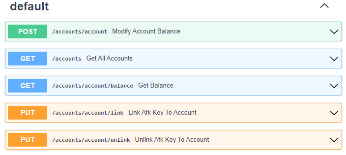
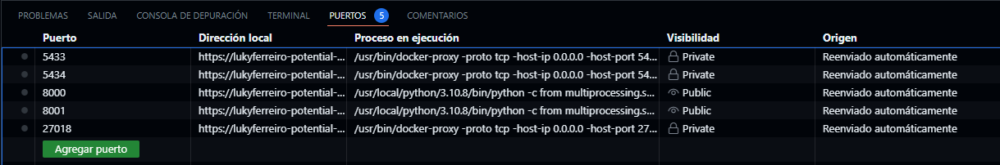
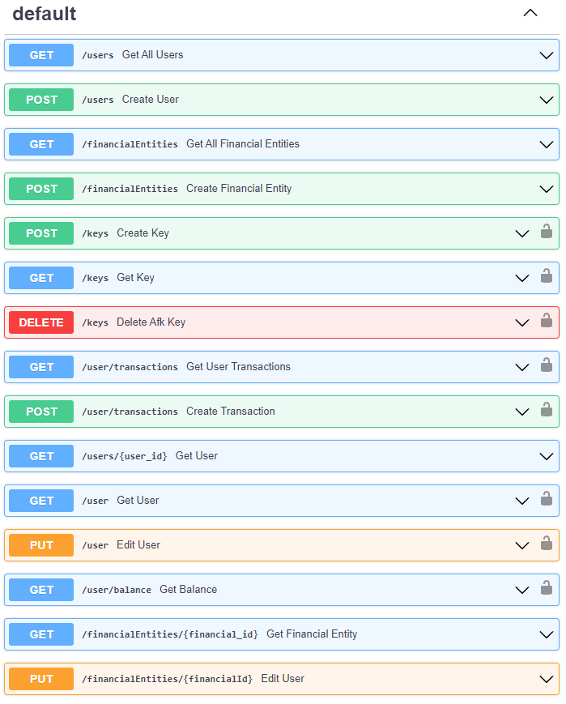
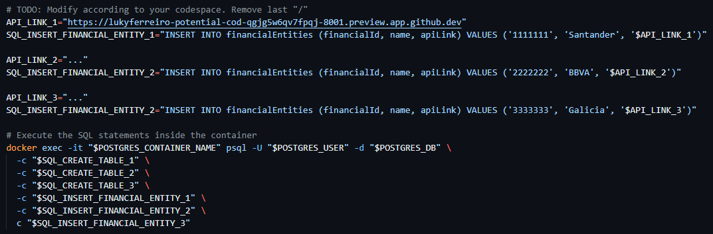

# TPE-BD2 - AFK System

## Autores
- [Tomas Alvarez Escalante](https://github.com/tomalvarezz)
- [Lucas Agustin Ferreiro](https://github.com/lukyferreiro)
- [Roman Gomez Kiss](https://github.com/rgomezkiss)

# Introducción

En este TPE se implemento 'AFK System': un sistema de pago electronico basado en un híbrido de reconocidos sistemas de Argentina y Brasil.
Para ello se implemento una API utilizando FastApi para modelar los endpoints de nuestro sistema, el cual cuenta con:
- Una base de datos PosgreSQL para almacenar y consultar los usuarios, claves AFK y entidades financieras.
- Una base de datos MongoDB para almacenar las transacciones entre los usuarios.

La idea principal es que un usuario pueda asociar un CBU de cualquier entidad financiera a una clave AFK. De esta forma, un usuario
podra transferir dinero a otro usuario (de cualquier entidad financiera) utilizando unicamente la clave AFK.
Cabe destacar que un CBU esta compuesto de 22 numeros, y a modo de simplificacion del sistema, los primeros 7 representaran el
ID de la entidad financiera.

Para realizar pruebas tambien se modelo una API bancaria en FastApi para representar aquella a la cual nuestro
sistema se conectaría para consultar saldos, transferir o descontar dinero o asociar una clave AFK a un CBU. 
Por simplificacion del las pruebas, todas las APIs bancarias utilizaran una base de datos PosgreSQL

# Requisitos

- Docker 20.10.15
- Python 3.10.8

# Funcionamiento

Todos los siguientes pasos seran explicados para realizarse en un entorno de GitHub Codespaces.

## 1. Levantar API de una entidad financiera

Posicionado en la carpeta /src/Banks se debe ejecutar:

```shell
./init.sh
```

Esto levantara un container de Docker con la base de datos de una entidad financiera.
Luego se debe ejecutar: 

```shell
./run.sh
```

Esto levantara la API del banco que estara conectada a la base de datos montada en el contenedor de Docker anterior.



### IMPORTANTE
1. Copiar la URL base de esta API (es decir, la que aparece en la url del navegador al correr el ./run.sh) y
copiarla en la variable API_LINK_1 del archivo /src/AFK_Sytem/init.sh

2. Verificar que los puertos respectivos de las API de los bancos se encuentren publicos.



# 2. Levantar API de AFK system

Posicionado en la carpeta /src/AFK_Sytem se debe ejecutar:

```shell
./init.sh
```

Esto levantara dos container de Docker con las bases de datos PosgreSQL y MongoDB para nuestro sistema.
Luego se debe ejecutar: 

```shell
./run.sh
```
Esto levantara la API de nuestro sistema que estara conectada a ambas bases de datos montadas en los contenedores.



# Funcionamiento con multiples bancos

Para poder simular varias APIs bancarias, se debera generar un nuevo GitHub Codespace independiente en el cual correremos
unicamente la API bancaria y repitiendo unicamente los pasos '1. Levantar API de una entidad financiera' y teniendo en cuenta
que se deberan agregar tantos API_LINK_N como N cantidad de API bancarias levantadas en GitHub Codespace independientes.

